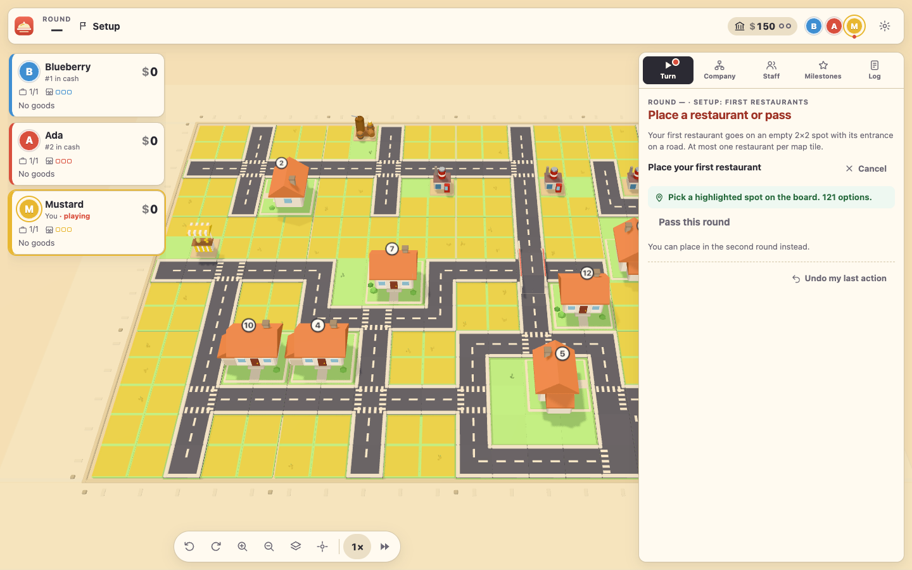

# Food Chain Magnate Online

An unofficial fan implementation of *Food Chain Magnate* (Splotter Spellen) for the browser: online multiplayer with a 3D board, hot-seat play on one device, and the Ketchup expansion modules.



- 2–5 players (6 with the Ketchup "6 Players" module), Deluxe Edition rules.
- Play over the internet or a LAN (rooms with a 5-letter code and QR join link), or hot-seat on one device.
- Server-authoritative rules engine; reconnect and page reloads keep your seat.
- 3D board (Three.js) with highlighted legal spots for every placement, plus a 2D fallback when WebGL is missing.
- Undo of your own actions until hidden information is revealed.

## Requirements

Node.js 20 or newer. Then:

```bash
npm install
```

## Running it

### Play on your network (LAN)

```bash
npm start
```

This builds everything and starts the server on port 3000. It prints the addresses to open, for example `http://192.168.1.20:3000`. Everyone on the same network opens that address. One player clicks **Create room**, the others join with the room code, the link, or the QR code shown in the lobby.

### Play online

Run the same server on a machine that is reachable from the internet (a VPS, or your own machine behind port forwarding), and share its address. Put it behind a TLS reverse proxy (Caddy, nginx) for `https://`; the WebSocket lives on the same origin at `/ws`.

Server settings (environment variables):

| Variable | Default | Meaning |
| --- | --- | --- |
| `PORT` | `3000` | HTTP and WebSocket port |
| `HOST` | `0.0.0.0` | Interface to listen on |
| `FCM_DATA_DIR` | `./data` | Where room snapshots are saved |
| `FCM_PERSIST` | on | `0` disables saving; rooms then live only in memory |

Rooms are saved as `{config, seed, actions}` and replayed when the server restarts, so games survive a restart.

### Hot-seat (one device)

Start the app (`npm start`, or `npm run dev` below), choose **Hot-seat** on the home screen, pick the player count and modules, and start. The app shows a "pass the device" screen between players so private choices (reserve card, structure) stay hidden. Hot-seat games run entirely in the browser; the server only serves the files.

### Development

```bash
npm run dev
```

Runs the server with live reload on port 3000 and the Vite dev server on port 5173 (open `http://localhost:5173`; it proxies `/ws` to the server). `#/dev` opens a gallery of canned game states for working on the UI without playing up to that point.

## Ketchup expansion modules

Choose modules in the room lobby (host) or the hot-seat setup.

| Module | What it adds |
| --- | --- |
| New Districts | Five new map tiles, including apartments that take double demand without limit. |
| Lobbyists | Lobbyists build roads (with roadworks) and parks; parks raise prices. |
| New Milestones | Seventeen new milestones replace the base ones. Not with Hard Choices. |
| Coffee | Baristas make coffee and open coffee shops; houses buy coffee on the way to dinner. |
| Kimchi | Kimchi Masters make kimchi in Clean up; houses prefer chains that add a kimchi. |
| Sushi | Sushi cooks and chefs; garden houses eat sushi when a chain has enough. |
| Noodles | Noodle cooks and chefs; houses nobody can serve eat noodles instead. |
| Ketchup | Earn a $1 Dinnertime edge when a rival sells to demand you created. |
| Fry Chefs | Fry Chefs add $10 to every sale. |
| Mass Marketeers | Each Mass Marketeer at work adds an extra marketing phase. |
| Night Shift Managers | Employees without a salary work twice while a Night Shift Manager is at work. |
| Rural Marketeers | Giant billboards market to the rural area, reached through freeways. |
| Gourmet Food Critics | Gourmet guides market to every house with a garden. |
| Reserve Prices | Reserve cards set the base unit price after the first bank break. |
| Movie Stars | Movie stars choose turn order first and win dinnertime ties. |
| Hard Choices | Some base milestones disappear after turn 2 or 3. Not with New Milestones. |
| 6 Players | A sixth chain and a 4×6 map. Requires New Districts. |

The intro game (no reserve cards, no salaries, ends at the first bank break) is a toggle in the same settings.

## Scripts

| Command | What it does |
| --- | --- |
| `npm start` | Build everything and run the server (port 3000) |
| `npm run dev` | Server with live reload + Vite dev server (port 5173) |
| `npm test` | Unit, scenario and integration tests (Vitest) |
| `npm run e2e` | Build, then run the Playwright browser tests in `e2e/` against the real server |
| `npm run lint` | Import-boundary check plus a full typecheck |
| `npm run typecheck` | TypeScript only |
| `npm run build` | Compile all packages and build the client into `packages/client/dist` |
| `npm run fixtures` | Regenerate the engine's canned test states |

First time running the browser tests: `npx playwright install chromium`.

## How it is built

TypeScript monorepo (npm workspaces):

| Package | Role |
| --- | --- |
| `packages/engine` | The rules: a pure, deterministic reducer with seeded randomness, per-player redaction and a module system (base game + 17 Ketchup modules). No dependencies. |
| `packages/protocol` | WebSocket message types and zod schemas. |
| `packages/session` | Rooms, seats, undo and per-viewer fan-out, independent of the transport. |
| `packages/server` | Node HTTP + WebSocket server, static files, persistence. |
| `packages/client` | Vite app: Preact + signals overlay UI and the Three.js board. |

Design and rules documents:

- `docs/architecture.md`: structure, engine API, protocol, client layers.
- `docs/protocol.md`: every wire message.
- `docs/rules/`: the rules specs the engine follows (base game, employees, milestones, map, Ketchup).
- `docs/visual-style.md`: palette and 3D style guide.

## Credits

*Food Chain Magnate* is designed by Jeroen Doumen and Joris Wiersinga and published by Splotter Spellen. This is an unofficial fan project for personal use. All art in this project is original.
